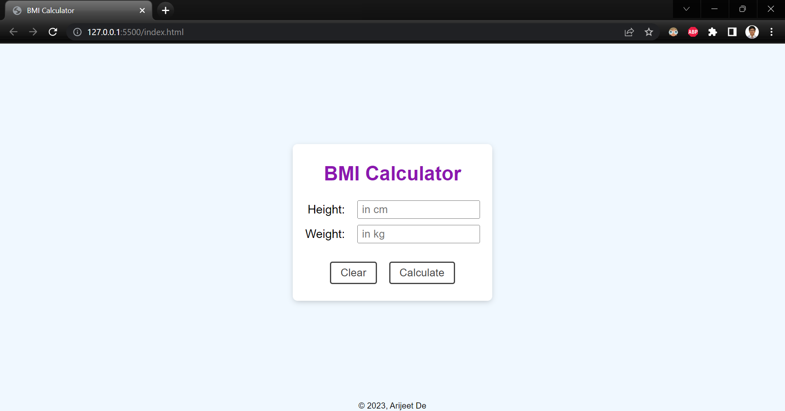

# BMI Calculator

Welcome to my web app called BMI Calculator. Input your height (in cm) and weight (in kg)  
and get to know your BMI and also which category your BMI belongs to.

## BMI Categories

- Underweight
- Normal
- Overweight
- Obesity Class-I
- Obesity Class-II
- Obesity Class-III

## Link

Measure your BMI today!  
[Web App Link](https://debroglie27.github.io/BMICalculator)

## Built with

- HTML
- CSS
- Javascript
- No external frameworks

## Screenshot

## Author

- Name: Arijeet De
- GitHub - [@debroglie27](https://github.com/debroglie27)
- Frontend Mentor - [@debroglie27](https://www.frontendmentor.io/profile/debroglie27)
- Facebook - [@arijeet.de](https://www.facebook.com/arijeet.de)
- Instagram - [@121debroglie](https://www.instagram.com/121debroglie/)